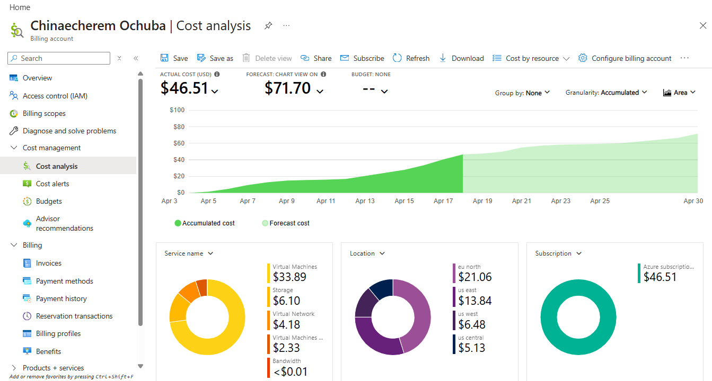
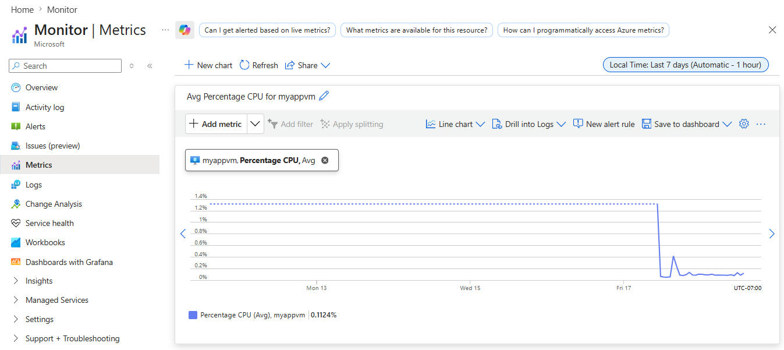
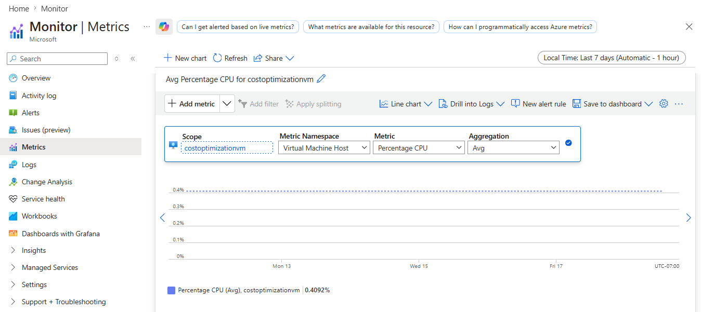
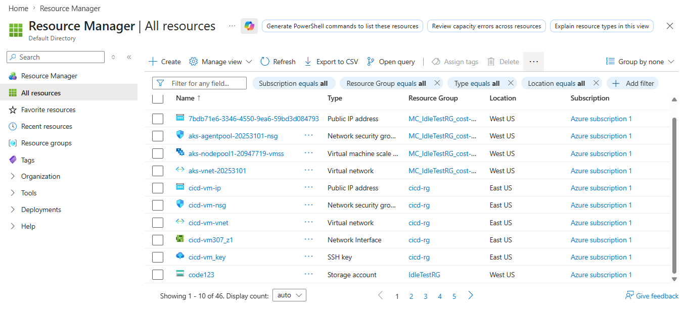
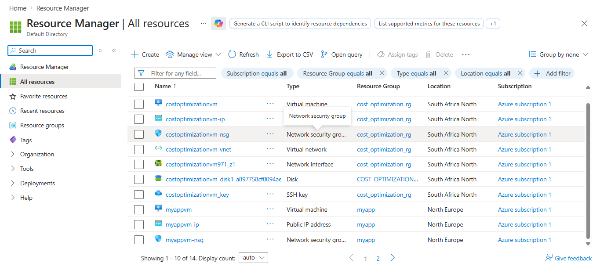

# Azure Cloud Cost Optimization Audit

## Overview
Cloud infrastructure costs can spiral quickly when resources are left running 
without oversight. This project presents a real-world cost optimization audit 
performed on a live Azure environment — identifying waste, acting on findings, 
and projecting measurable savings.

## The Problem
A cloud environment was running 46 resources across multiple regions with no 
cost governance in place. Monthly spend had reached $46.51 with a forecast of 
$71.70 by end of month — a trajectory that would compound without intervention.

## Audit Findings

### 1. Overprovisioned Virtual Machines
Two VMs were running 24/7 with near-zero CPU utilization:

| VM | Avg CPU Usage | Status |
|---|---|---|
| myappvm | 0.11% | Severely over-provisioned |
| costoptimizationvm | 0.41% | Severely over-provisioned |

Virtual machines accounted for $33.89 out of $46.51 total spend — 73% of 
the entire bill — while delivering almost no compute workload.

### 2. Zombie Resources
Resources left running after their parent workloads were deleted:

| Resource | Type | Resource Group | Action |
|---|---|---|---|
| dockervm and all associated resources | VM, Disk, IP, NIC | docker | Deleted |
| cicd-vm-ip, cicd-vm-nsg, cicd-vm-vnet | Network resources | cicd-rg | Deleted |
| IdleTestVM and associated resources | VM, Disk, IP, NIC | IdleTestRG | Flagged |
| Orphaned OS Disks | Disk | Multiple | Flagged |

### 3. Unnecessary Network Watchers
6 Network Watchers running across 6 regions when only 2 regions were actively 
in use — centralus, eastus, westus, westus2 were all redundant.

## Actions Taken
- Deleted docker resource group — VM, disk, public IP, network interface removed
- Deleted cicd-rg — orphaned network resources removed
- Removed redundant Network Watchers in unused regions
- Documented right-sizing recommendations for remaining VMs

## Projected Savings

| Action | Estimated Monthly Saving |
|---|---|
| Delete docker resource group | $8-12 |
| Delete cicd-rg orphaned resources | $3-5 |
| Right-size overprovisioned VMs | $17-20 |
| Total Projected Saving | $28-37/month |

Current monthly spend: $46.51
Projected spend after optimization: $9-18/month
Estimated reduction: 60-80%

## Tools Used
- Azure Cost Management — baseline cost analysis and forecasting
- Azure Monitor — CPU utilization metrics per VM
- Azure Advisor — resource optimization recommendations
- Azure Portal — resource audit and cleanup

## Screenshots

### Cost Baseline

### VM CPU Utilization — myappvm

### VM CPU Utilization — costoptimizationvm

### All Resources Before Cleanup

### All Resources After Cleanup

## Key Lessons
- Cloud waste is invisible without active monitoring
- VM costs dominate most cloud bills — CPU utilization is the first metric to check
- Orphaned resources accumulate silently — regular audits are essential
- Cost optimization is not about cutting corners — it's about removing waste 
  while keeping critical services running

## Environment
- Cloud Provider: Microsoft Azure
- Subscription Type: Pay-as-you-go
- Audit Period: April 2026